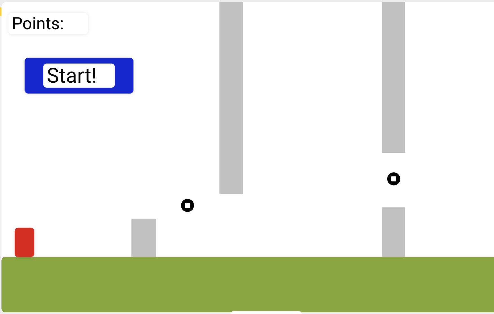

# Project-1

## Overview

My game is called Running Man. It's inspired by the original Super Mario Bros. released in 1985. The user will have the option to use the "up" or "down" arrow keys as well as "w" or "s" to navigate through obstacles and collect coins to reach the point goal to win. If user hits an obstacle the game ends.

Technologies used:
* HTML5
* CSS
* Javascript - canvas

## User Stories

As a user, I want the ability to...
- press start to begin the game.
- press "up" key or "w" to jump.
- press "down" key or "s" to crouch.
- view my score on top left of the screen.
- collect coins to earn points.
- restart the game if game ends before collecting all the points.
- collect 25 points to win the game

## Wireframes / Screenshots

## Entity Relationship Diagrams (ERDs)

Character: {
  x: (x location on the canvas)
  y: (y location on the canvas)
  height: (should be smaller than obstacle)
  width: (should be smaller than obstacle)
  color: red
  alive: (a boolean that determines if game is in progress)
}

Obstacle: {
  x: (x location on the canvas)
  y: (y location on the canvas)
  height: (should be taller than character)
  width: (should be wider than character)
  color: grey
  alive: (a boolean that determines if game is in progress)
}

function - gameloop - holds the entire logic that runs the game.
function - pointCount - keeps score and ends game if point goal is reached.
function - movementHandler - used to move the character around, attached to "up" and "down" arrow keys and "w" and "s" keys
function - detectHit - used to see it character hit an obstacle

